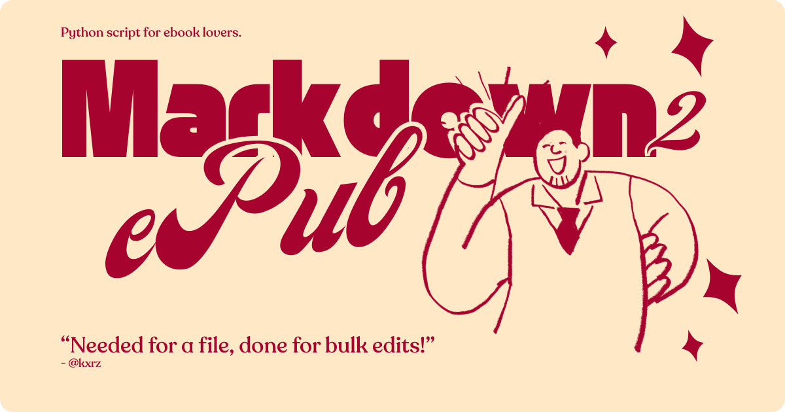
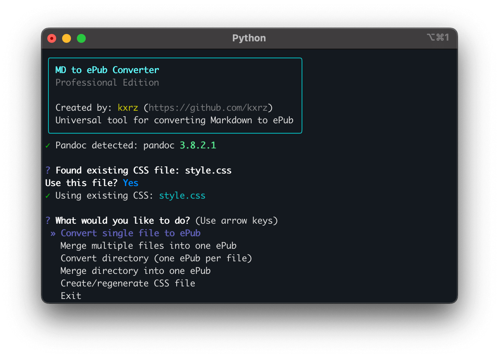

# MD to ePub Converter - Interactive Edition

**Created by:** kxrz ([GitHub](https://github.com/kxrz))

A Python tool to convert Markdown files to beautifully formatted ePub books with an interactive terminal interface and advanced features.



## Features

### Core Capabilities
- **Interactive TUI** with beautiful terminal menus (powered by questionary)
- **5 conversion modes**:
  1. Single file → Single ePub
  2. Multiple files → Merged ePub (NEW!)
  3. Directory → Multiple ePub (one per file)
  4. Directory → Single merged ePub (NEW!)
  5. Recursive directory processing
- **Smart CSS management**: Auto-detection, creation, and custom CSS support
- **Complete metadata support**: Author (required), title, description, publisher, date, language
- **Progress indicators** and beautiful console output
- **Backward compatible CLI** for automation and scripting
- **Optimized ePub CSS** with professional typography

### What's New in Professional Edition
- **Merge multiple MD files** into a single ePub with proper chapter separation
- **Interactive menus** for all operations - no more command-line guesswork
- **Mandatory author validation** to ensure proper metadata
- **Enhanced CSS** optimized for e-readers (Kobo, Kindle, Apple Books, etc.)
- **YAML frontmatter support** for per-file metadata
- **Rich terminal output** with colors, panels, and progress bars



## Installation

### 1. Prerequisites

#### Install Pandoc
Pandoc is required for the conversion process:

**macOS:**
```bash
brew install pandoc
```

**Linux (Ubuntu/Debian):**
```bash
sudo apt install pandoc
```

**Windows:**
Download and install from [pandoc.org](https://pandoc.org/installing.html)

### 2. Install Python Dependencies

```bash
pip install -r requirements.txt
```

This installs:
- `questionary` - Interactive terminal prompts
- `rich` - Beautiful terminal output
- `PyYAML` - YAML parsing
- `python-frontmatter` - Markdown metadata extraction

### 3. Make Executable (Linux/macOS)

```bash
chmod +x md_to_epub.py
```

## Usage

### Interactive Mode (Recommended)

Simply run the script without arguments to launch the interactive menu:

```bash
python md_to_epub.py
```

You'll see a beautiful welcome screen and menu with options:

```
┌─────────────────────────────────────────────────┐
│         MD to ePub Converter                    │
│         Professional Edition                    │
│                                                 │
│ Created by: kxrz (https://github.com/kxrz)      │
│ Universal tool for converting Markdown to ePub  │
└─────────────────────────────────────────────────┘

? What would you like to do?
  ❯ Convert single file to ePub
    Merge multiple files into one ePub
    Convert directory (one ePub per file)
    Merge directory into one ePub
    Create/regenerate CSS file
    Exit
```

### CLI Mode (For Automation)

The tool maintains full backward compatibility with the original CLI:

#### Convert a Single File
```bash
python md_to_epub.py document.md --author "Your Name"
```

#### Convert All Files in a Directory
```bash
python md_to_epub.py --dir ./notes --output ./epubs --author "Your Name"
```

#### Merge Directory into One ePub
```bash
python md_to_epub.py --dir ./book_chapters --merge --title "My Book" --author "Your Name"
```

#### Use Custom CSS
```bash
python md_to_epub.py document.md --css custom_style.css --author "Your Name"
```

#### Recursive Conversion
```bash
python md_to_epub.py --dir ./docs --recursive --output ./epubs --author "Your Name"
```

#### Create Optimized CSS File
```bash
python md_to_epub.py --create-css
```

## Command-Line Options

```
usage: md_to_epub.py [-h] [--dir DIR] [--output OUTPUT] [--css CSS]
                     [--create-css] [--recursive] [--author AUTHOR]
                     [--title TITLE] [--merge]
                     [input]

Options:
  input                 Markdown file or directory to convert
  --dir, -d            Directory containing .md files
  --output, -o         Output directory for ePub files
  --css, -c            Custom CSS file path
  --create-css         Create optimized CSS file
  --recursive, -r      Include subdirectories
  --author, -a         Author name (required for CLI mode)
  --title, -t          Title for ePub
  --merge, -m          Merge multiple files into one ePub
```

## Conversion Modes Explained

### 1. Single File Conversion
Convert one Markdown file to one ePub. Perfect for:
- Individual articles
- Short documents
- Single-chapter books

**Interactive:** Select "Convert single file to ePub" from menu
**CLI:** `python md_to_epub.py file.md --author "Name"`

### 2. Merge Multiple Files (NEW!)
Select specific Markdown files and merge them into a single ePub. Ideal for:
- Combining related articles
- Creating compilations
- Building books from separate chapters

**Interactive:** Select "Merge multiple files into one ePub" from menu
**CLI:** Not available - use interactive mode for file selection

### 3. Batch Directory Conversion
Convert all Markdown files in a directory to separate ePub files. Great for:
- Large document collections
- Note libraries
- Blog post archives

**Interactive:** Select "Convert directory (one ePub per file)" from menu
**CLI:** `python md_to_epub.py --dir ./folder --author "Name"`

### 4. Directory Merge (NEW!)
Merge all Markdown files in a directory into one ePub. Perfect for:
- Book projects with multiple chapter files
- Documentation sites
- Tutorial series

**Interactive:** Select "Merge directory into one ePub" from menu
**CLI:** `python md_to_epub.py --dir ./chapters --merge --title "Book" --author "Name"`

### 5. Recursive Processing
Process directories and all subdirectories. Works with both individual and merge modes.

**Interactive:** Select "Include subdirectories?" when prompted
**CLI:** Add `--recursive` flag

## CSS Styling

### Smart CSS Detection

The tool automatically:
1. Detects if `style.css` exists in the current directory
2. Prompts you to use it or create a new one
3. Allows custom CSS file selection
4. Generates optimized CSS if none exists

### Optimized ePub CSS

The generated CSS includes:
- **Professional typography**: Georgia serif for body, Helvetica for headings
- **E-reader optimizations**: Proper page breaks, font fallbacks, hyphenation
- **Responsive design**: Works on all screen sizes
- **Complete element support**: Code blocks, tables, images, quotes, lists
- **Print-friendly**: Proper margins, orphan/widow control
- **Accessibility**: High contrast, readable sizes

### CSS Features
- Reset styles for consistency
- Justified text with smart indentation
- Chapter breaks on H1 headings
- Syntax highlighting for code
- Styled blockquotes with blue accent
- Responsive images and tables
- Proper link handling
- Footnote support

### Customizing CSS

To create and edit the default CSS:
```bash
python md_to_epub.py --create-css
```

Then edit `style.css` to your preferences. The tool will automatically detect and use it.

## Metadata Management

### Interactive Metadata
In interactive mode, you'll be prompted for:
- **Title**: Auto-generated from filename, editable
- **Author**: Required field, cannot be empty
- **Description**: Optional
- **Publisher**: Optional
- **Language**: Default 'en', customizable
- **Publication date**: Optional (YYYY-MM-DD format)

### YAML Frontmatter Support

Add metadata to your Markdown files:

```markdown
---
title: My Amazing Document
author: Your Name
description: A comprehensive guide
lang: en
date: 2025-01-15
publisher: Self-Published
---

# Chapter 1

Your content here...
```

### CLI Metadata

When using CLI mode, specify metadata via flags:
```bash
python md_to_epub.py book.md \
  --author "Your Name" \
  --title "My Book" \
  --lang "en"
```

## Supported Markdown Elements

The converter supports all standard Markdown:

- **Headings** (`#` through `######`)
- **Bold** and *italic* text
- `Inline code` and code blocks with syntax highlighting
- [Links](https://example.com) and images
- Ordered and unordered lists
- Nested lists
- > Blockquotes
- Horizontal rules (`---`)
- Tables
- Footnotes
- Definition lists
- Task lists

### Special Features

**Table of Contents**: Automatically generated with 3-level depth

**Chapter Breaks**: H1 (`#`) creates new chapters, H2 (`##`) creates sections

**Images**: Local images are embedded in the ePub

**Code Highlighting**: Fenced code blocks preserve formatting

## Tips & Best Practices

### File Organization

For books with multiple chapters:
```
my_book/
├── 01_introduction.md
├── 02_chapter_one.md
├── 03_chapter_two.md
└── 99_conclusion.md
```

Use numeric prefixes to control merge order.

### Headings Structure
```markdown
# Chapter Title (becomes chapter in ePub)
## Section Heading
### Subsection
```

### Images
```markdown

```
Use relative paths. Images are automatically embedded.

### Metadata Frontmatter
Always include at the top of your main file or merged document:
```markdown
---
title: Professional Document Title
author: Your Full Name
description: Brief description for catalogs
lang: en
---
```

### Testing ePub Output

After generating your ePub:
1. Test on multiple readers (Calibre, Apple Books, Kobo, Kindle)
2. Check table of contents navigation
3. Verify images display correctly
4. Review formatting on different screen sizes

## Examples

### Example 1: Convert Personal Notes
```bash
# Interactive mode
python md_to_epub.py

# Select: Convert directory (one ePub per file)
# Directory: ~/Documents/notes
# Author: Your Name
```

### Example 2: Create a Book from Chapters
```bash
# Interactive mode
python md_to_epub.py

# Select: Merge directory into one ePub
# Directory: ./book_chapters
# Title: My First Novel
# Author: Your Name
# Include subdirectories: No
```

### Example 3: Quick Single File (CLI)
```bash
python md_to_epub.py article.md --author "Jane Doe"
```

### Example 4: Batch Convert with Custom CSS
```bash
python md_to_epub.py \
  --dir ./articles \
  --output ./ebooks \
  --css custom.css \
  --author "John Smith" \
  --recursive
```

### Example 5: Merge All Documentation
```bash
python md_to_epub.py \
  --dir ./docs \
  --merge \
  --title "Complete Documentation" \
  --author "Dev Team" \
  --output ./ebooks
```

## Troubleshooting

### Pandoc Not Found
```
✗ Pandoc is not installed!
```
**Solution**: Install Pandoc using instructions above

### Missing Dependencies
```
❌ Missing dependencies!
Please install: pip install -r requirements.txt
```
**Solution**: Run `pip install -r requirements.txt`

### No Files Found
```
✗ No .md files found in directory
```
**Solution**: Check directory path, ensure files have `.md` extension

### Conversion Errors
- Verify Markdown syntax is valid
- Check that referenced images exist
- Ensure file encoding is UTF-8

### CSS Not Applied
- Verify CSS file path is correct
- Check CSS file exists
- Regenerate CSS with `--create-css`

## E-Reader Compatibility

Tested and optimized for:
- Kobo (Nia, Clara, Libra, Sage, Elipsa)
- Kindle (with conversion via Calibre)
- Apple Books (macOS/iOS)
- Google Play Books
- Adobe Digital Editions
- Calibre

## Transfer to E-Readers

### Kobo
1. Connect via USB
2. Copy `.epub` files to the root or `Books/` folder
3. Safely eject

### Kindle
1. Use Calibre to convert ePub to MOBI/AZW3
2. Transfer via USB or email to Kindle address

### Apple Books
1. Open ePub file with Books app
2. Or drag and drop into Apple Books

## Development

### Project Structure
```
md_to_epub/
├── md_to_epub.py      # Main script (1140 lines)
├── requirements.txt   # Python dependencies
└── readme.md          # This file
```

### Key Classes
- `EpubConverter`: Main conversion logic
- CSS optimization for e-readers
- Interactive TUI with questionary
- Rich console output

### Contributing

This is a personal project by kxrz, but suggestions and feedback are welcome!

Issues and improvements: [Open an issue on GitHub](https://github.com/kxrz/md_to_epub/issues)

## Version History

### v2.0 - Professional Edition (2025)
- Added interactive TUI with questionary
- New merge functionality (multiple files → one ePub)
- Smart CSS detection and management
- Enhanced metadata with validation
- Progress bars and rich output
- Improved ePub-optimized CSS
- 5 distinct conversion modes

### v1.0 - Initial Release
- Basic CLI conversion
- Single file and batch directory modes
- CSS support
- Pandoc integration

## License

Free to use and modify for personal and commercial projects.

Credit appreciated but not required: kxrz ([GitHub](https://github.com/kxrz))

## Credits

**Created by**: kxrz ([GitHub](https://github.com/kxrz))

**Built with**:
- [Pandoc](https://pandoc.org/) - Universal document converter
- [questionary](https://github.com/tmbo/questionary) - Interactive prompts
- [Rich](https://github.com/Textualize/rich) - Beautiful terminal output
- [python-frontmatter](https://github.com/eyeseast/python-frontmatter) - Metadata parsing

**Optimized for**: Kobo Xteink X4 and other modern e-readers

---

**Enjoy converting your Markdown to beautiful ePub books!** 📚

For help: `python md_to_epub.py --help`
For interactive mode: `python md_to_epub.py`

*Made with care for the reading community by [kxrz](https://github.com/kxrz)*
